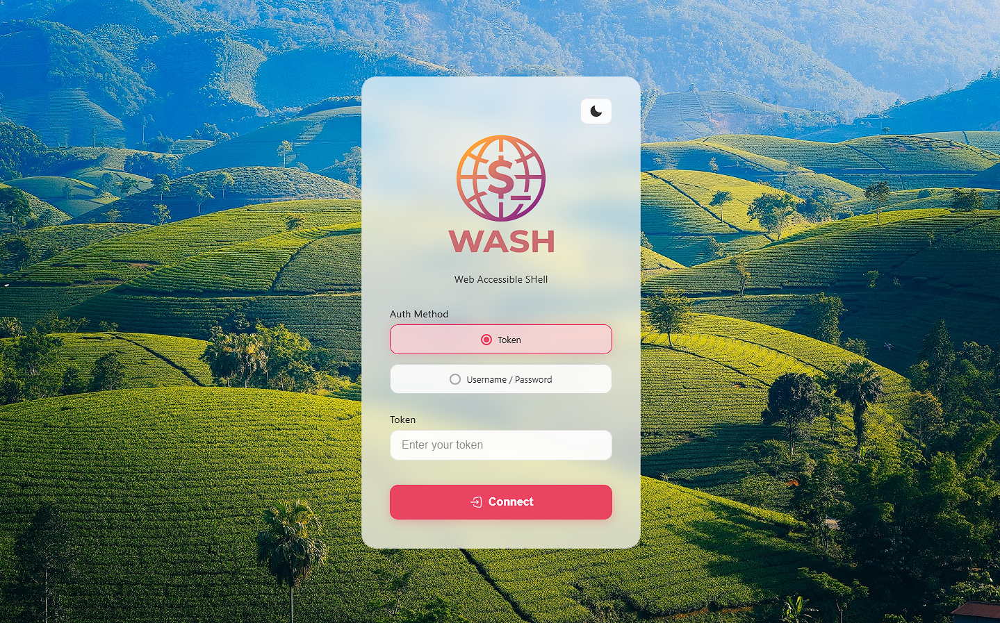

# WASH — Web Accessible Shell

<p align="center">
  
</p>

> Cross-platform Go application providing remote shell access via WebSocket and REST API.

## Quick Links

- 🧪 **Auto-tests Guide**: [docs/AUTO_TESTS.md](docs/AUTO_TESTS.md)
- 📖 **Full English Docs**: [docs/README.md](docs/README.md)
- 🔧 **Configuration Guide**: [docs/CONFIGURATION.md](docs/CONFIGURATION.md)
- 📡 **API Reference**: [docs/API_REFERENCE.md](docs/API_REFERENCE.md)
- 🧩 **Endpoint Summary**: [docs/ENDPOINTS_SUMMARY.md](docs/ENDPOINTS_SUMMARY.md)
- 🧪 **Testing Guide**: [docs/TESTING.md](docs/TESTING.md)
- 🛠 **Troubleshooting**: [docs/TROUBLESHOOTING.md](docs/TROUBLESHOOTING.md)

## Overview

**WASH** is a cross-platform Go application that provides remote shell access through three interfaces:

1. **WebSocket** (`/ws`) — PTY-based shell protocol for custom clients.
2. **REST API** (`POST /api/command`) — single-command execution via HTTP POST with JSON request/response.
3. **Web GUI** (`GET /`) — browser-based xterm.js terminal with auth screen, theme toggle, auto-reconnect, and system status bar.

<p align="center">
  
</p>

## Quick Start

```bash
# Interactive setup (recommended for first install)
bash setup-linux.sh          # Linux
powershell -File setup-windows.ps1   # Windows

# Or manual build
go build -o WASH

# Run with token authentication
./WASH -token=MY_SECRET_TOKEN -port=9091

# Run with OS authentication
./WASH -os-auth -port=9091
```

Open a browser and navigate to `http://localhost:9091/` — you'll see a login form.
Enter your token (or OS credentials) and click Connect to access the xterm.js terminal.

## Features

- ✅ **Setup scripts** — interactive TUI for Linux (`setup-linux.sh`) and Windows (`setup-windows.ps1`) with auto-install of Go, config generation, and optional token/OS auth toggles
- ✅ Cross-platform support (Linux, macOS, Windows)
- ✅ Interactive PTY-based shell via WebSocket with xterm.js
- ✅ Windows ConPTY support with OEM/ANSI codepage decoding
- ✅ Real system metrics (CPU, memory, uptime) via WMI on Windows, sysctl on macOS
- ✅ Configurable shell (sh, bash, zsh, fish) via config.yaml
- ✅ REST API for scripted command execution
- ✅ Token-based authentication
- ✅ OS user/password authentication (Linux `su`, Windows `LogonUser`)
- ✅ Graceful shutdown on SIGINT/SIGTERM
- ✅ Multiple concurrent sessions
- ✅ Native WebSocket keepalive (PingMessage every 30s)
- ✅ Auto-reconnect with exponential backoff (1s–30s)
- ✅ Theme backgrounds (light/dark)
- ✅ Embedded static files — zero external web dependencies

## Documentation Structure

| File | Description |
|------|-------------|
| [docs/README.md](docs/README.md) | Full English documentation |
| [docs/CONFIGURATION.md](docs/CONFIGURATION.md) | Configuration guide (YAML, .env, CLI) |
| [docs/API_REFERENCE.md](docs/API_REFERENCE.md) | Complete API reference |
| [docs/ENDPOINTS_SUMMARY.md](docs/ENDPOINTS_SUMMARY.md) | Endpoint quick reference |
| [docs/TESTING.md](docs/TESTING.md) | Test results and known issues |
| [docs/TROUBLESHOOTING.md](docs/TROUBLESHOOTING.md) | Troubleshooting guide |
| [docs/AUTO_TESTS.md](docs/AUTO_TESTS.md) | Auto-tests guide (Russian) |

## License

This project is licensed under the MIT License. See [LICENSE](LICENSE) for details.
